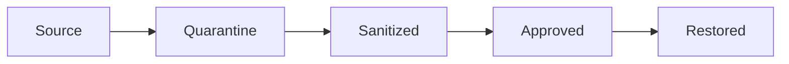

# umzug-toolkit

Controlled Linux data migration when changing hardware or distributions.
Python tooling separates signed transport, quarantine, review, explicit
approval and restore, with checkpoints and rollback for system changes.

I built it for moving my own data and settings between laptops and PCs.
[Background and decisions](docs/PORTFOLIO.md).

**Release candidate `v0.2.0rc1`.** Evaluation is limited to the documented H0
offline baseline on disposable Debian / Ubuntu hardware with systemd.
Hardware qualification remains open. Other platforms, `strict` / `maximal`,
Mullvad / H2 and production operation are not qualified.
[Project status](PROJECT_STATUS.md) · [Hardware scope](docs/HARDWARE-TEST.md).

## Try the local examples

Requirements: Linux, Python 3.11+, pytest and OpenSSL. The examples use
temporary files and keys and do not require root or change system configuration.

```sh
python scripts/portfolio-demo.py
python scripts/transport-smoke.py
```

The component demo covers nine regression cases for signatures, approvals,
restore and rollback. The transport smoke test uses the real pack CLI to
verify signed transport, exact extracted bytes, tamper rejection and preservation
of an existing destination. It does not exercise scanners or privileged restore.
[Setup and expected results](docs/DEMO.md).

Run the full local checks in a prepared test environment:

```sh
./scripts/static-checks.sh
```

This runs syntax checks, tests and a reproducible double offline wheel build.
ShellCheck and YARA compilation run when their tools are installed; skipped
checks must be reported. [Commands and output](docs/VALIDATION.md).

## Migration model



Manifests and hashes bind transitions to specific data. Source mounts must use
`ro,noexec,nodev,nosuid`. Scanners run with limits and pinned tools in a
networkless Bubblewrap environment. Unanalyzable content is blocked; restore
requires explicit approval.

Restore preserves existing destinations and does not import execute bits,
SUID / SGID bits, ACLs, xattrs or capabilities. The source system stays
untrusted; valid signatures and scanner results do not guarantee malware-free
content. [Threat model](docs/THREAT-MODEL.md).

## Evidence and known limitations

The September 2026 Arch Linux runs passed 508 tests and three subtests, the
demo and reproducible build, including a follow-up with Python 3.11.15.
The earlier Fedora / SELinux run had eight failing metadata-restore tests.
The green Arch results do not resolve the SELinux compatibility limitation.
[Environment-specific results](docs/VALIDATION.md) ·
[SELinux finding and reproduction](docs/KNOWN-ISSUES.md).
[Current GitHub workflows](https://github.com/panzaknacker/umzug-toolkit/actions)
are separate from these local results.
[Hosted startup failure and current CI state](docs/HOSTED-CI.md).

The planner displays diffs and requires confirmation. Backups and checkpoints
support continuation and rollback. Systemd and firewall guards can deliberately
stop boot or network access on failure. Automatic partitioning, full user /
group migration, FDE, Secure Boot key enrollment and general CDR are absent.
Mullvad is a separate final network step.
[User guide](docs/USER-GUIDE.md) · [Limits](docs/LIMITATIONS.md).

[Latest local review and logs](docs/LOCAL-REVIEW-2026-10-01.md).

## Documentation

- [Demo](docs/DEMO.md) · [Validation](docs/VALIDATION.md) · [Project status](PROJECT_STATUS.md)
- [Architecture](docs/ARCHITECTURE.md) · [Workflow](docs/EXAMPLE-WORKFLOW.md)
- [Recovery](docs/RECOVERY.md) · [Offline build](docs/OFFLINE-BUILD.md)
- [Testing](docs/TESTING.md) · [Hardware qualification](docs/HARDWARE-TEST.md)
- [Contributing](CONTRIBUTING.md) · [Security reports](SECURITY.md)

Some detailed engineering notes and historical evidence are in German.

## License

[GPL-3.0-or-later](LICENSE).
